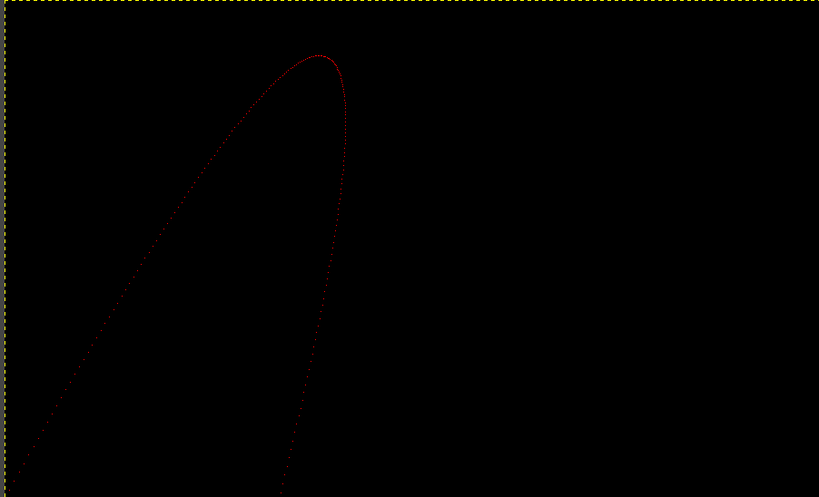
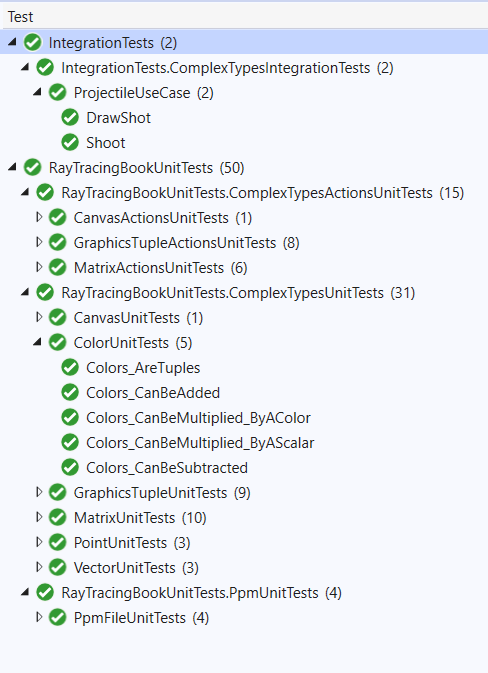
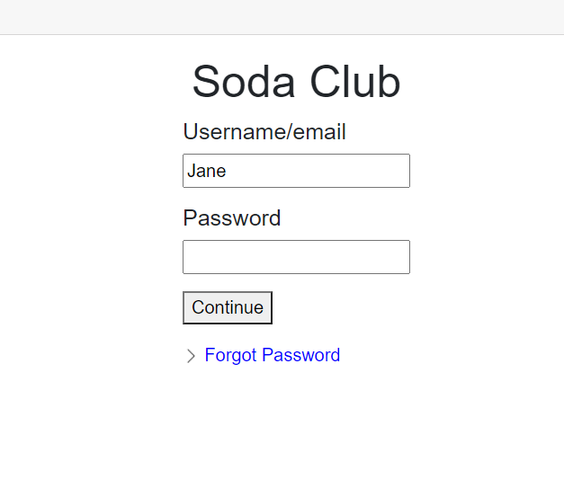
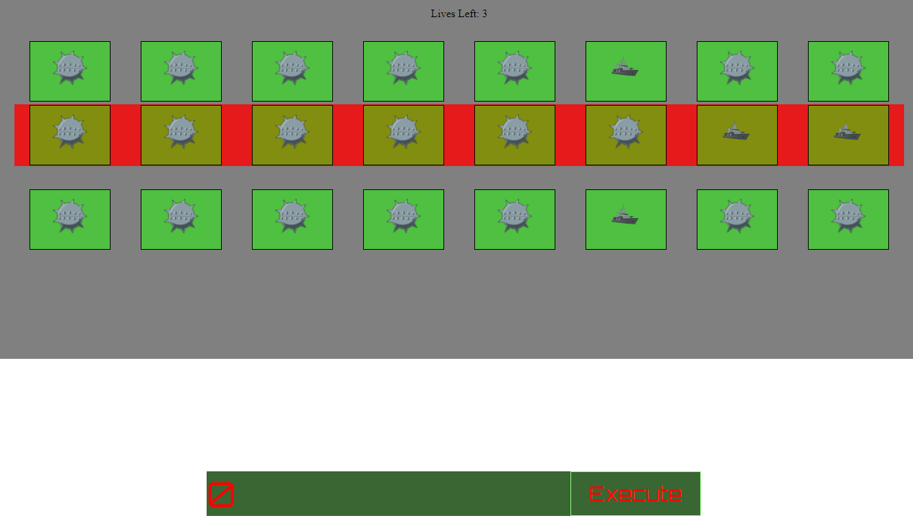

# Hey, I'm Michaela! 

I'm a software Engineer currently living in Minneapolis ❄. I enjoy playing games (Currently Gloomhaven, Magic Arena and Dark Souls II), reading sci-fi and fantasy and riding my bike all around town (also on weightlifting!). I'm teaching myself game development in my free time. 

## Projects 📦

### Arabic Typing Practice 
No tutorials this time! Just stumbling around trying to make a little game to help me learn to type in Arabic. I'm using Godot and GDScript. As it stands the game starts and allows a player to type in characters. If the chracter matches it turns green, if it does not the character changes and turns red. 

Lastest Progress: 

This is the visulization of the Leitner System that is the underlying algorithm used to select which words will appear in a given study session

This is a general tour of the new feel of the application

Bare bones beginning

#### Future Features 
 - [ x] Load in vocabulary (currently set to just a single set of words)
 - [ x] Record player score
 - [x ] Use a third party API to pull audio of word pronunciation
 - [ ] Give the option to change the word to English after it is typed
 - [ ] Remove duplicate words when user uploads multiple copies
 - [ ] cache the .mp3 file for each word pronunciation as a resource associated with that word so you don't have to fetch it every time (and also decreases chance of being blocked by reverso)
 - [ ] Create map of code
 - [ ] Figure out why the back button from "settings" stalls/hangs
 - [ ] Write a little explanation of how I got the verbal pronunciation of each word to load 
       
### Ray Tracer 🎨
I am following a test-first guide to writing a ray tracer. 
This picture is really faint, but there is a precious red parabola for those really looking close.
I have decided to do it in C#! 
https://github.com/MichJadams/RayTracingBook

Look at these beautiful tests 🧪

### Unity Course 🎒
Working through a course to learn Unity! Currently I've created a number guessing game that 'barrows' heavily from GLAdUS (from Portal). 
And now working on a breakout game.
With my breakout game I'm working on creating interesting blocks that fall, or react to physics. 
I'm also adding interesting ball effects, such as getting larger. 

Example of boulder smash game play as of 6-8-2021

 - [x] Ball gets bigger every 5 bounces
 - [x] Player death and restart game loop is complete 
 - [x] Player score is kept
 - [x] Certain blocks fall when hit 
 - [ ] The paddle works as a sea-saw, allowing player to have two balls that bounce one at a time
 - [ ] Create custom assets 

### Forgot Password 🤔
A little game a friend came up with where the whole thing is to guess passwords based on hints. This was a proof of concept I made and deployed to surprise him. There isn't any content yet, just a basically game loop and win condition.
https://forgotpassword20210419165204.azurewebsites.net/

### Battle Bits 🛳
I made this game when I was first starting out, and I still enjoy it's concept and design.

## Languages 
- C# ⭐⭐⭐⭐⭐
- TypeScript/JavaScript ⭐⭐⭐⭐
- Python ⭐⭐⭐⭐
- SQL ⭐⭐
- Rust ⭐

## Tools 🔨
- Git. And Github. 
- Visual Studio. And Visual Studio Code
- Jira
- Microsoft Sequel Server Studio 

## Concepts 💭
- Unit Testing, Integration Testing (Mostly in C#, once or twice with selenium)
- Agile Methodologies (Card Creation, Point Estimation, Sprint Planning)
- Code Reviews (C#, TypeScript)
